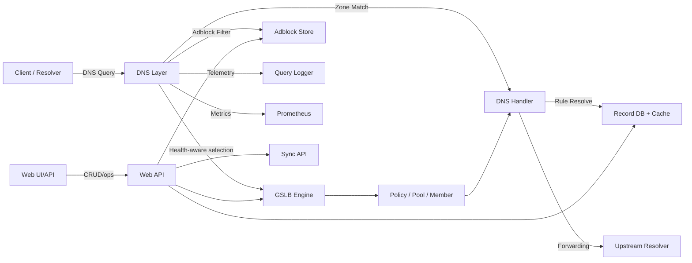
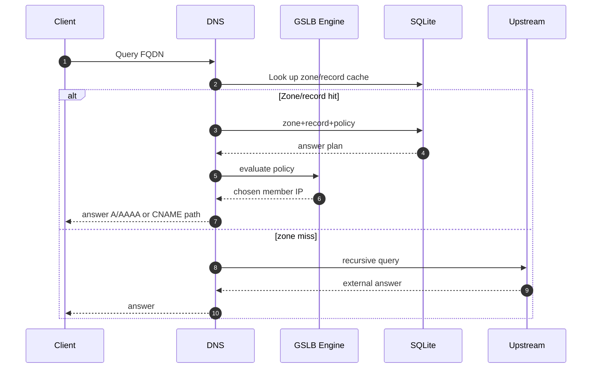
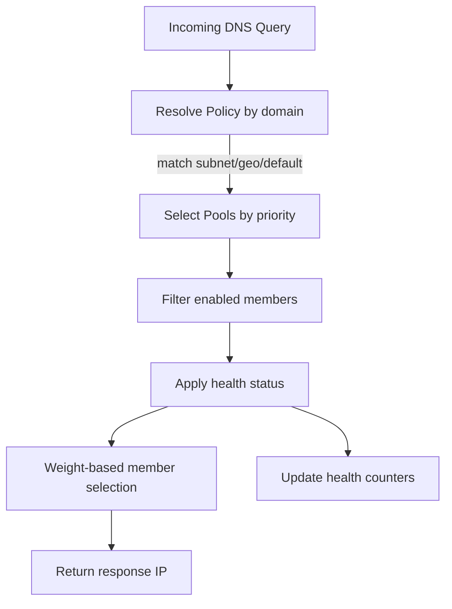
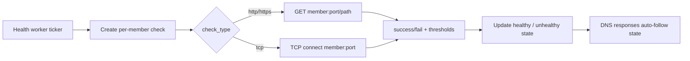
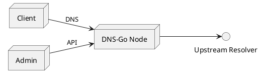
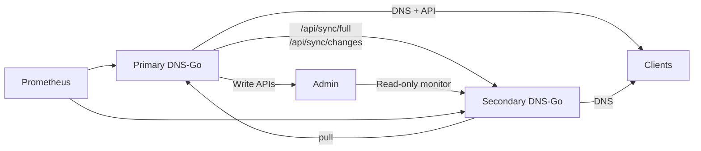
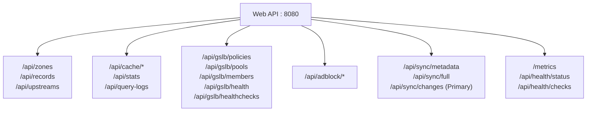
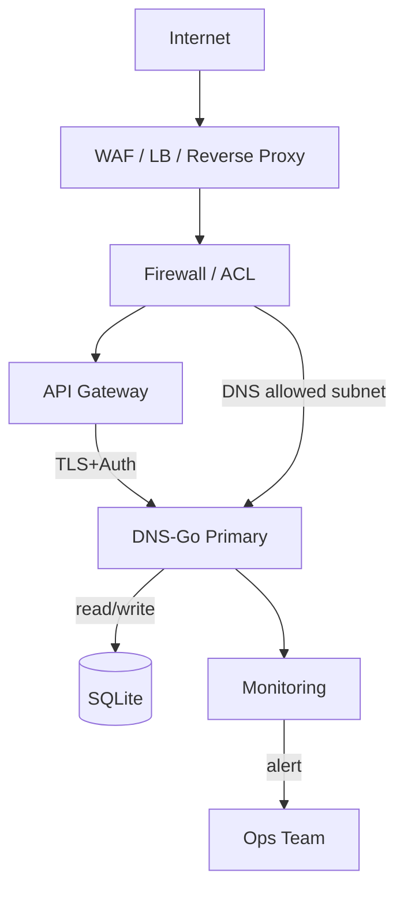

# DNS-Go

## Enterprise-grade DNS Service

DNS-Go is positioned as an **enterprise-ready DNS platform** for edge and multi-region operation.

- Core DNS resolution with recursive behavior
- GSLB policy routing with subnet/geo/default matching
- Health-check-driven failover
- Adblock filtering and sync pipeline
- Query cache, metrics, and query log controls
- Built-in Primary/Secondary sync model

> 엔터프라이즈급 DNS를 전제로 한 운영형 DNS 플랫폼입니다.  
> 재해복구, 운영 분리, 모니터링을 고려한 구성을 기본으로 설계되어 있습니다.

## 1) Why DNS-Go / 왜 DNS-Go인가

DNS-Go is built for startups, small teams, and independent developers who need practical DNS infrastructure without buying a large commercial traffic-management product too early.

AI-assisted development makes it easier to build and ship services quickly, but production operations still need reliable DNS, failover, traffic routing, observability, and filtering. DNS-Go aims to make those enterprise-style primitives available as a lightweight, self-hosted, open-source platform.

> 작은 스타트업과 개인 개발자가 비싼 엔터프라이즈 DNS/GSLB 제품을 바로 구매하지 않아도, 운영에 필요한 핵심 DNS 인프라를 직접 구성하고 개선할 수 있도록 돕는 것이 목표입니다.

## 2) What this project is / 프로젝트 개요

DNS-Go exposes both DNS and HTTP management surfaces.



## 3) Architecture and data path / 아키텍처와 데이터 플로우

### 3.1 DNS request path / DNS 요청 처리



### 3.2 GSLB and health workflow / GSLB/헬스체크 처리



### 3.3 Health check cycle / 헬스체크 주기



## 4) Deployment modes / 배포 모드

### Single node / 단일 노드



### Primary + Secondary / 이중 구성 (권장)



### Deployment recipes / 배포 형태

- `docker-compose.yaml`: prebuilt image quick start
- `docker-compose.yml`: local build/start with Dockerfile
- direct binary: production binary for host integration and hardened service mgmt

## 5) API Surface at a glance / API 한눈보기



- Core docs:
  - [GSLB API](./docs/GSLB_API.md)
  - [DNS API](./docs/API_SPEC.md)

## 6) Feature matrix / 기능 매트릭스

| Area | Description | Enterprise value |
| --- | --- | --- |
| Zone/Record | DNS zone and RR CRUD API | 운영 정책 즉시 적용 및 형상 관리 |
| GSLB | Policy/Pool/Member 분리 | 지역/망 분리 라우팅, 탄력적 트래픽 분산 |
| Healthcheck | 정책 단위 체크, 임계치 기반 failover | 장애 감지 시 자동 배제 |
| Adblock | 외부 소스 동기화 | 내부망 오염/악성 도메인 차단 |
| Cache | clear, setting, stats, domain clear | 장애 대응 및 트래픽 급변 대응 |
| Observability | `/api/stats`, `/api/query-logs`, `/metrics` | 운영 가시성 확보 |
| HA | Primary/Secondary + read-only | 운영 분리/안전한 이중화 운영 |

## 7) Quick start / 빠른 시작

### Option 1. Build and run locally / 로컬 바이너리 실행

```bash
git clone <repo-url>
cd dns-go
go build -o dns-server .
sudo ./dns-server
```

### Option 2. Docker build compose / Docker 빌드 실행

```bash
docker compose -f docker-compose.yaml up -d --build
```

### Option 3. Use prebuilt image / 사전 빌드 이미지 실행

```bash
cp docker-compose.yml docker-compose.local.yml
docker compose up -d
```

### 7.1 Runtime default ports / 기본 포트

- DNS: `53/tcp`, `53/udp`
- API: `8080`

> Port 53 requires elevated privilege on Unix-like OS. Use systemd `cap_net_bind_service`, rootless wrapper, or container capabilities.

## 7.2 Simple benchmark / 간단 성능 벤치마크

You can benchmark your target environment using generic values.

```bash
# DNS UDP
for i in $(seq 1 1000); do
  dig +time=2 +tries=1 @<dns-server> <test-domain> A | awk '/Query time:/ {print $4}'
done

# DNS TCP
for i in $(seq 1 300); do
  dig +tcp +time=2 +tries=1 @<dns-server> <test-domain> A | awk '/Query time:/ {print $4}'
done
```

```bash
# HTTP API baseline
for i in $(seq 1 1000); do
  curl -o /dev/null -s -w '%{time_total}\\n' http://<target>:8080/api/stats
done
```

## 8) Configuration example / 설정 예시

```yaml
dns:
  listen: "0.0.0.0"
  port: 53
  tcp: true
  udp: true
  udp_size: 1232
  nsid: "dns-go-primary"
  version: "DNS-Go v0.3.0"

upstream:
  timeout: 5s

web:
  listen: "0.0.0.0"
  port: 8080

database:
  path: "./dns-go.db"

geoip:
  city_db: "./GeoLite2-City.mmdb"

adblock:
  enabled: true
  sync_interval: 1h
  block_response: "0.0.0.0"

sync:
  mode: "primary"              # or secondary
  primary_url: "http://primary:8080"
  interval: 1s
  readonly: false

logging:
  level: "info"
  query_log:
    enabled: true
    dir: "./query-logs"
    retention_days: 7
    flush_interval: 2s
    buffer_size: 1000
```

## 9) Production hardening / 운영 시 보안 가이드



- API currently has no built-in identity provider. Add:
  - network isolation / mTLS / auth gateway
  - source IP allow-list for web endpoints
  - TLS termination and reverse-proxy logging
- For Secondary: keep write paths blocked and run as read-only.
- Keep policy/zone changes in separate change windows and backup DB files.
- Periodically prune/rotate query logs and GeoIP DB updates.

## 10) Security and maintenance focus / 보안 및 유지관리 방향

DNS-Go handles infrastructure paths where defects can directly affect availability and network security: DNS request parsing, cache behavior, health-check decisions, administrative APIs, sync endpoints, and filtering pipelines.

Current maintenance focus:

- Expand DNS handler, GSLB, sync, and cache test coverage
- Add regression tests for malformed DNS packets and API inputs
- Improve race-condition detection around health status and cache updates
- Harden admin and sync API deployment guidance with auth gateway, mTLS, and ACL examples
- Keep dependency updates and vulnerability scanning part of the normal release workflow

## 11) Roadmap / 로드맵

- [ ] Built-in authentication or pluggable auth middleware for the management API
- [ ] mTLS examples for Primary/Secondary sync traffic
- [ ] DNSSEC validation/signing investigation
- [ ] Configuration validation and dry-run mode before applying production changes
- [ ] More deterministic GSLB policy tests and failover simulations
- [ ] Security test suite for DNS parsing, cache behavior, and API input validation
- [ ] Release automation with changelog, signed artifacts, and container image provenance
- [ ] Operator-friendly docs for small teams running DNS-Go in production

## 12) Enterprise readiness checklist / 엔터프라이즈 준비 체크리스트

- [ ] Primary/Secondary 구성 및 싱크 확인
- [ ] `/metrics`, `/api/stats` 수집 연동
- [ ] 질의 로그 보존 정책 설정
- [ ] 읽기/쓰기 API 경로 분리 정책 수립
- [ ] GeoIP DB 갱신 정책 등록
- [ ] 장애 시나리오 점검 (백엔드 장애, policy mis-config, DNS TTL)
- [ ] 보안망 분리 및 ACL 점검

## License / 라이선스

This project is distributed under the **MIT License**.
프로젝트 라이선스는 **MIT License**입니다.

- See: [LICENSE](./LICENSE)
